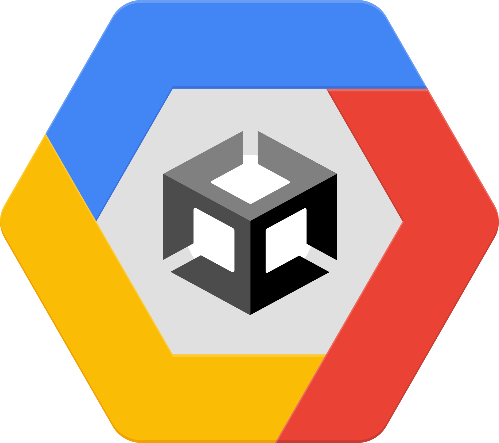
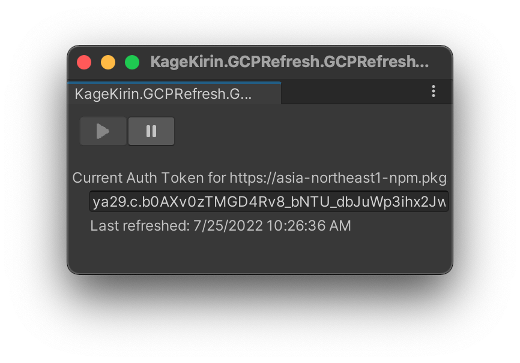

# GCPRefresh for Unity



A Unity Editor extension to run `gcloud auth` every _n_ minutes to refresh the `~/.upmconfig.toml` with an updated GCP auth token.

## Installation

Add the following registry to Unity's scoped registries,
and this package to the dependencies.

```json
{
  "scopedRegistries": [
    {
      "name": "OpenUPM",
      "url": "https://package.openupm.com",
      "scopes": [
        "com.kagekirin"
      ]
    }
  ],
  "dependencies": {
    "com.kagekirin.unitygcprefresh": "0.0.7"
  }
}
```

## Setup

After installing GCPRefresh, you will need to set up the Google Cloud Artifact Registry
for which to automatically refresh the auth token.
The menu is under `Project Settings / GCPRefresh`.


## Automatically refreshing the GCP auth token

You might have noticed the new entry `GCP / Refresh GCP Token` in the menu bar.
This opens the window below:



Clicking on the _Start_ button will directly refresh the token,
and then enter a waiting phase depending on the refresh rate in the Project Settings.

Clicking on the _Stop_ button will stop the automatic refreshing process.
